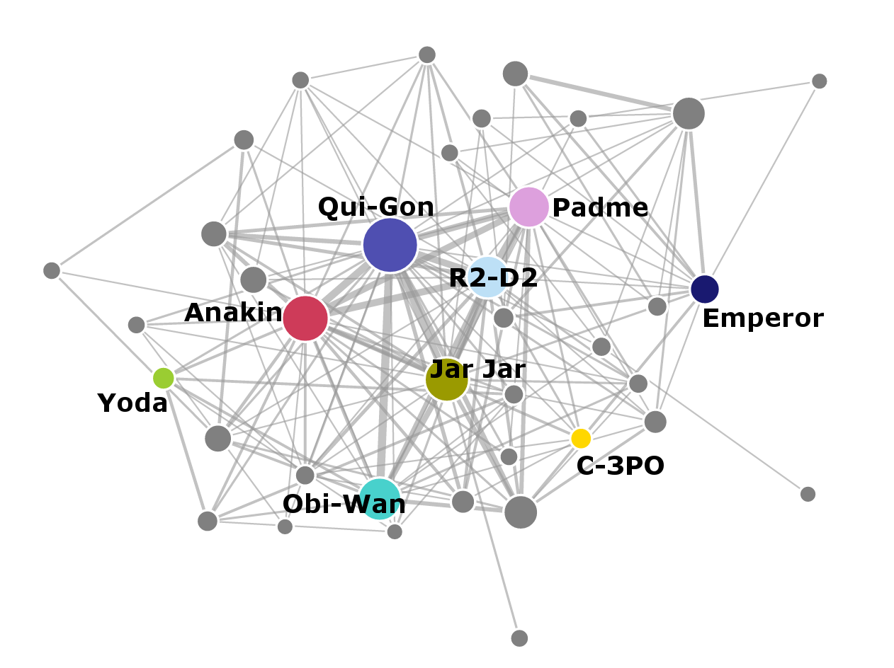

- title : Exploring the Star Wars universe
- description : DataBeers@London
- author : Evelina Gabasova
- theme : white
- transition : none

***

- data-background : images/cancer-unit.jpg

<table>
<tr>
  <td class="noborder" style="width:50%;">

## 
Evelina Gabasova

### 
@evelgab

### 
evelinag.com

 
 

MRC Cancer Unit 

 

University of Cambridge

</td>
  <td class="noborder" style="width:50%;"></td>
</tr>
</table>

' Hello, I'm Evelina Gabasova

---

- data-background : images/tcga-dna.jpg

' During the day, I do bioinformatics and computational biology,
' researching mechanisms of early carcinogenesis at Cambridge
' University - I deal with DNA, genes, proteins etc...
' It's a very important work, we work on pancreatic cancer which 
' one of the least understood types of cancer. It's very hard to treat
' and mortality hasn't improved much over the last 10 years, so it's a big 
' and important challenge. We use quite a lot of methods, based on 
' statistics, machine learning and network analysis. 
' But biology is complex and sometimes it's a bit too much...

---

- data-background : images/pathways.png

' do you know the feeling? So because I love working with data, outside
' of work I like to play with other datasets, datasets that are
' probably less useful...

---

- data-background : images/intro-databeers-noloop.gif

---

- data-background : #550080

# 
 star wars 

## Social network

' Enter the Star Wars social network

------

- data-background : #f2a063

' This structure is highly formalised, names have to be in boldface and centered etc.
' This is easy to parse if you write a program to do this

----

- data-background : white

-----

- data-background : images/itsatrap3.gif

---

- data-background : images/r2d2beeps-loop3.gif

--------

- data-background : #f2a063

--------

- data-background : #f2a063

---

- data-background : #550080

## Number of *common* mentions

# ⬇

## Number of interactions

--------

- data-background : images/ewoks.gif

---

- data-background : images/networks/full_network-darth-vader.png

<a href="images/networks/interactions-merged.html" style="color: transparent;"> Big link to full network   Big link to full network  Big link to full network </a>

----------

### 
a new hope 
 

----------

### 
the phantom menace

----------

### 
the force awakens

---

### 
 Size 

-----

### 
 Density 

--------

### 
 Clustering Coefficient 

' How many of your friends in the network are also friends with each other
' What it means in terms of the story

---

### 
 Centrality 

<small>
<table>
<tr>
  <td class="noborder" style="padding-right: 100px">

| | Name | Degree |
|---|-----|-----|
| 1. | POE | 16 |
| 2. | FINN | 14 |
| 3. | HAN | 14 |
| 4. | CHEWBACCA | 12 |
| 5. | BB-8 | 12 |

</td>
  <td class="noborder">

| | Name | Betweenness |
|---|-----|-----|
1. | POE | 97.2 |
2. | KYLO REN | 71.9 |
3. | REY | 38.7 |
4. | BB-8 | 29.1 |
5. | FINN | 26.8 |

</td>
</tr>
</table>
</small>

---

- data-background : images/poe_dancing.gif

---

- data-background : images/obi-wan-noloop.gif

---

- data-background : images/cell-betweenness.jpg

---

- data-background : images/kyloapproves-loop3.gif

---

- data-background : images/kylo.gif

<table>
<tr>
  <td class="noborder" style="width:50%;"></td>
   <td class="noborder" style="width:50%;">

## 
Evelina Gabasova

@evelgab 
 

github.com/evelinag

</td> 
</tr>
</table>

